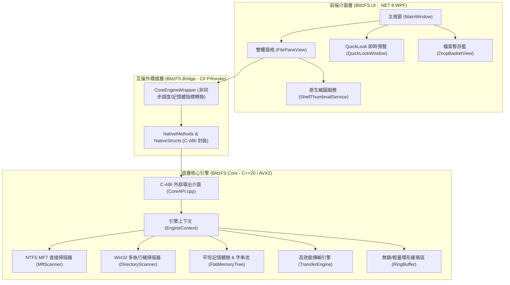

# ⚡ BlitzFS — 極速現代化智慧檔案總管

<p align="center">
  
  
  
  
</p>

<p align="center">
  <b>BlitzFS</b> 是一款專為 Windows 平台打造的次世代極速檔案總管。結合 <b>C++20 高效能核心引擎</b>（NTFS 直接 MFT 解析、連續平坦記憶體池、非同步重疊 I/O 傳輸）與 <b>.NET 8 WPF 現代化 Fluent 風格雙欄介面</b>，帶來毫秒級搜尋、超低記憶體佔用與極致流暢的操作體驗。
</p>

---

## ✨ 核心特色

### 🚀 1. 毫秒級極速掃描與超低記憶體佔用
* **NTFS Direct MFT 解析**：透過 `FSCTL_ENUM_USN_DATA` 直接讀取底層 USN 日誌與 MFT 記錄，百萬級檔案掃描僅需約 1 秒。
* **平坦化記憶體樹（Flat Memory Tree）**：自建連續記憶體池與緊湊節點（每個檔案節點精確對齊 48 Bytes）搭配字串池（String Pool），100 萬個檔案常駐記憶體僅約 48MB，具備極致的 CPU L1/L2 快取命中率。
* **雙引擎容錯掃描**：對 NTFS 磁區啟動直接 MFT 掃描；對於 FAT32 / exFAT 或一般目錄自動降級為多執行緒並發 Win32 API 掃描。

### 📦 2. 高效能傳輸引擎（Transfer Engine）
* **智慧瞬時搬移**：同一磁區下的移動直接透過檔案系統中繼指標秒級完成。
* **跨磁區 Direct / Overlapped I/O**：大檔案採用非同步雙緩衝重疊 I/O 平行管線傳輸，小檔案平行並發處理，完整保留檔案時間戳與 Windows 屬性。
* **即時進度與速率監控**：提供傳輸 Byte 數、檔案數、即時傳輸速度 (MB/s) 與錯誤攔截回呼。

### 🎨 3. 現代雙欄 Fluent Design 介面
* **獨立雙欄瀏覽（Dual-Pane）**：支援左右分欄獨立導航、Tab 標籤頁切換、一鍵同步路徑或快速將檔案複製/移動至對側窗格。
* **極速縮圖快取（Shell Thumbnail Service）**：串接 Windows 原生 `IShellItemImageFactory`，支援大圖示/詳細資料模式切換與非同步非阻塞縮圖快取。
* **空白鍵快速預覽（QuickLook）**：
  * 🖼️ **圖片與影片**：高解析度圖片即時顯示、影片流暢播放。
  * 📝 **文字與原始碼**：代碼行號、語法色彩與 UTF-8/ANSI 自動辨識。
  * 🔢 **二進位檔案**：內建 Hex 十六進位檢視器。
* **檔案暫存籃（Drop Basket）**：跨資料夾暫存/收集檔案，支援一鍵批次移動、複製或打包處理。

---

## 🏛️ 系統架構



---

## 📂 專案目錄結構

```text
BlitzFS/
├── BlitzFS.slnx                     # Visual Studio 方案檔
├── CMakeLists.txt                   # 頂層 CMake 建置設定 (C++20, /O2, /AVX2)
├── LICENSE                          # MIT 授權條款
├── README.md                        # 專案說明文件
├── src/
│   ├── BlitzFS.Core/                # [C++20] 底層極速核心引擎
│   │   ├── include/                 # 公開標頭檔 (CoreAPI.h, CommonDef.h, IEngine.h)
│   │   └── src/                     # 核心實作 (MFTScanner, FlatMemoryTree, TransferEngine...)
│   ├── BlitzFS.Bridge/              # [C# .NET 8] P/Invoke 橋接層與託管封裝
│   │   ├── CoreEngineWrapper.cs     # 託管非同步 API 包裝
│   │   ├── NativeMethods.cs         # Win32 & CoreAPI 原生函式宣告
│   │   └── NativeStructs.cs         # 記憶體對齊結構定義
│   └── BlitzFS.UI/                  # [C# WPF] 現代化 Fluent UI 應用程式
│       ├── Views/                   # 視圖層 (MainWindow, FilePaneView, QuickLookWindow...)
│       ├── ViewModels/              # 視圖模型 (MainViewModel, PaneViewModel, TransferViewModel...)
│       ├── Services/                # 原生縮圖、剪貼簿與圖示快取服務
│       └── Styles/                  # 現代調色盤、向量圖示與控制項樣式
└── tests/
    └── BlitzFS.Core.Tests/          # [C++20] 核心引擎自動化驗證與效能校驗測試
        ├── CMakeLists.txt
        └── main.cpp
```

---

## 🛠️ 建置與執行指南

### 系統環境要求
* **作業系統**：Windows 10 (1809+) 或 Windows 11 (x64)
* **開發工具**：
  * [Visual Studio 2022](https://visualstudio.microsoft.com/) (需勾選 `.NET 桌面開發` 與 `使用 C++ 的桌面開發`)
  * [.NET 8.0 SDK](https://dotnet.microsoft.com/download/dotnet/8.0)
  * [CMake 3.20+](https://cmake.org/download/)

---

### 步驟 1：編譯 C++ 核心引擎 (`BlitzFS.Core.dll`)

在專案根目錄開啟 PowerShell 終端機執行：

```powershell
# 建立建置目錄並產生 VS 專案
cmake -B build -A x64

# 編譯 Release 版本的 BlitzFS.Core.dll
cmake --build build --config Release
```

編譯完成後，二進制檔案將輸出於 `build/bin/Release/BlitzFS.Core.dll`。

---

### 步驟 2：建置並啟動 WPF 介面 (`BlitzFS.UI`)

```powershell
# 進入 UI 專案目錄
cd src/BlitzFS.UI

# 建置並執行應用程式
dotnet run -c Release
```

> **提示**：`BlitzFS.UI` 已設定專案依賴與自動複製機制，會自動載入編譯好的 `BlitzFS.Core.dll`。

---

### 步驟 3：執行 C++ 核心引擎驗證測試（選用）

```powershell
# 執行核心引擎沙盒與效能測試
.\build\bin\Release\BlitzFS.Core.Tests.exe
```

---

## ⌨️ 常用快捷鍵與操作

| 快捷鍵 / 操作 | 功能說明 |
| :--- | :--- |
| <kbd>Space</kbd> (空白鍵) | 開啟 / 關閉 **QuickLook** 即時快速預覽視窗 |
| <kbd>Ctrl</kbd> + <kbd>T</kbd> | 在當前窗格新增分頁標籤（Tab） |
| <kbd>Ctrl</kbd> + <kbd>W</kbd> | 關閉當前分頁標籤 |
| <kbd>Ctrl</kbd> + <kbd>C</kbd> / <kbd>Ctrl</kbd> + <kbd>X</kbd> | 複製 / 剪下選取的檔案 |
| <kbd>Ctrl</kbd> + <kbd>V</kbd> | 貼上檔案（自動呼叫底層極速傳輸引擎） |
| <kbd>F5</kbd> | 重新整理目錄並觸發極速重新掃描 |
| <kbd>Alt</kbd> + <kbd>D</kbd> | 快速聚焦路徑列並全選文字 |
| **拖曳至暫存籃** | 將不同資料夾的檔案拖入右下方「暫存籃」暫存，隨後一次批次移動/複製 |

---

## 📄 授權條款 (License)

本專案採用 [MIT License](LICENSE) 授權開源。
